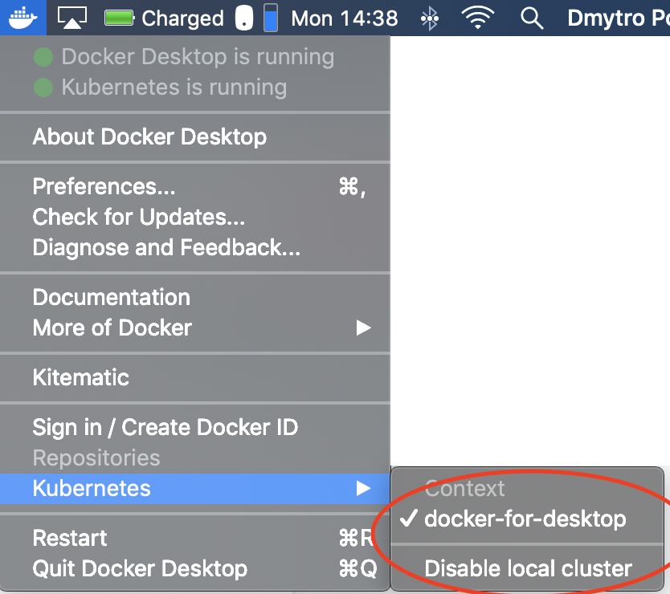

# Les prérequis


## Install on Mac

### Docker 

Installer [docker](https://docs.docker.com/docker-for-mac/install/)

> De préférence mettre `4Go` pour docker for mac

### Kubernetes cluster

Activer le kubernetes dans "docker for mac" :
<p>

</p>

### Vérifier l'installation Kubernetes 

```sh
$ kubectl version
$ kubectl config current-context
```

### Installer Helm CTL

```sh
$ brew update
$ brew install kubernetes-helm
```


## Install on Linux (ubuntu)

### Docker 

Installer [docker](https://docs.docker.com/install/linux/docker-ce/ubuntu)

### Kubernetes cluster

Install [minikube](https://kubernetes.io/docs/tasks/tools/install-minikube/)

### Vérifier l'installation Kubernetes 

```sh
$ kubectl version
$ kubectl config current-context
```

### Installer Helm CTL

Voir [the helm installation guide](https://helm.sh/docs/using_helm/#installing-helm)

## Installer Kubernetes Dashboard (optionnel)

```sh
$ kubectl apply -f https://raw.githubusercontent.com/kubernetes/dashboard/v1.10.1/src/deploy/recommended/kubernetes-dashboard.yaml
$ kubectl proxy
```

Afficher [Kubernetes Dashboard](http://localhost:8001/api/v1/namespaces/kube-system/services/https:kubernetes-dashboard:/proxy/.) avec le browser

<details><summary>Si le bouton Skip n'est pas affiché dans la mire de login</summary>
<p>

* Stopper le proxy
* Vérifier que la configuration n'a pas l'option *enable-skip-login*
* Patcher la configuration du dashboard
* Vérifier que l'option a été rajoutée
* Relancer le proxy
 
```sh
$ kubectl -n kube-system get deployment kubernetes-dashboard --output yaml | grep enable-skip-login
$ kubectl -n kube-system patch deployment kubernetes-dashboard --patch "$(cat patch-kubernetes-dashboard-deployment.yaml)"
$ kubectl -n kube-system get deployment kubernetes-dashboard --output yaml | grep enable-skip-login
$ kubectl proxy
```
        
</p>
</details>

> Voir [kubernetes/dashboard](https://github.com/kubernetes/dashboard) pour plus d'instructions

## Initialize Helm and Install Tiller

Installer Tiller dans le cluster Kubernetes :

```sh
$ helm init
```

[< Previous](ex0-getting-started.md) | [Home](README.md) | [Next >](ex1-using-charts.md)