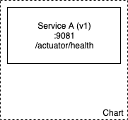
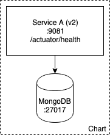

# Exercice 2 - Créer son propre chart

Dans cet exercice nous allons créer et déployer un chart contenant notre premier microservice (`Microservice A`). 
La version `v1` de `Microservice A` ne dépend d'aucun autre service. 
La version `v2` quant-à-elle, dépend de la base `mongodb` (et donc du chart du même nom).

## 1. Initialiser un chart

<p>

</p>

### Détails
Helm permet d'initialiser un nouveau chart selon un template standard.
Le nouveau chart se présente sous la forme d'un répertoire avec une arborescence des fichiers précise.

### Instructions
* Initialisez un nouveau chart nommé `xke-helm-microservice-a` avec la commande `helm create`
<details><summary>Solution</summary>
<p>

    $ helm create xke-helm-microservice-a

</p>
</details>


## 2. Microservice A (v1)

<p>

</p>

### Détails :
* Le `Microservice A` (v1) n'a aucune dépendance
* Le tag de l'image Docker à utiliser est `xebiafrance/xke-helm-microservice-a:v1`
* L'application est exposée sur le port `9081`

### Instructions :
* Le template généré utilise une image Docker de `nginx`, expose le port `80` et déclare un endpoint de healthcheck sur `/` 
(voir `templates/deployment.yaml`, section `containers`)
* Modifier le fichier `values.yaml` 
    * section `image` - pointer sur l'image Docker de `Microservice A` (v1). 
    * section `service` - `type: NodePort` et `port: 9081`
    * _Note: Ne modifiez aucun fichier *SAUF* `values.yaml`_
    
* Modifier le fichier `deployment.yaml` pour inclure le healthcheck du chart
    * Compléter les sections `livenessProbe` et `readinessProbe`
        * Modifier le path : `/actuator/health`
        * Ajouter un `initialDelaySeconds` (30s)
        * Ajouter un `timeoutSeconds` (10s)
    * Modifier le port, valeur `9081`
* Déployer le chart avec `helm install`

<details><summary>Solution</summary>
<p>

```sh
$ cd <chart directory>
$ helm install .
```
</p>
</details>


* Vérifier dans le dashboard l'état du pod
* (Optionnel) Exposer le endpoint de monitoring en local

<details><summary>Solution</summary>
<p>

```sh
$ kubectl get services
$ kubectl port-forward svc/<service name> 9081:9081
$ curl http://localhost:9081
```

</p>
</details>

    
## 3. Microservice A (v2)

### Détails :
* La *v2* du `Microservice A` nécessite `mongodb`
* Le `host` et le `port` de mongodb sont injectés via les variables d'environnement :

```
MONGODB_HOST
MONGODB_PORT
```

### Instructions :
* Ajouter une dépendance au chart de mongodb (`stable/mongodb:5.9.0`)

<details><summary>Solution</summary>
<p>

Créer un fichier `requirements.yaml` à la racine du chart

```yaml
    dependencies:
      - name: mongodb
        version: 5.9.0
        repository: https://kubernetes-charts.storage.googleapis.com/
```

</p>
</details>

* Mettre à jour les dépendances du chart

<details><summary>Solution</summary>
<p>

```sh
$ cd <chart directory>
$ helm dep update .
```

</p>
</details>

* Désactiver le mot de passe de mongodb dans `xke-helm-microservice-a/values.yaml`

<details><summary>Solution</summary>
<p>

Ajouter dans `values.yaml` :

```yaml
    mongodb:
        usePassword: false
```

</p>
</details>

* Ajouter les variables d'environnement à la definition du conteneur dans `xke-helm-microservice-a/templates/deployment.yaml`, section `spec.containers`)
    * `MONGODB_HOST` - `"{{- printf "%s-%s" .Release.Name "mongodb" | trunc 63 | trimSuffix "" -}}"`
    * `MONGODB_PORT` - `"{{- .Values.mongodb.service.port -}}"`  

<details><summary>Solution</summary>
<p>

Ajouter dans `deployement.yaml` dans la section `spec.containers` :

```yaml
    spec:
      containers:
        - name: {{ .Chart.Name }}

        ...

          env:
            - name: MONGODB_HOST
              value: "{{- printf "%s-%s" .Release.Name "mongodb" | trunc 63 | trimSuffix "" -}}"
            - name: MONGODB_PORT
              value: "{{- .Values.mongodb.service.port -}}"
              
        ...
```

</p>
</details>

* Mettre à jour la release avec `helm upgrade`

<details><summary>Solution</summary>
<p>

```sh
$ cd <chart directory>
$ helm upgrade <relase name> .
```

</p>
</details>

* Vérifier que la révision de votre release a été incrémentée 

[< Previous](ex1-using-charts.md) | [Home](README.md) | [Next >](ex3-parent-chart.md)