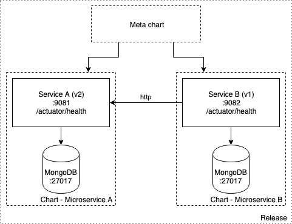

# Exercice 3 - Créer un chart parent

Dans cet exercice nous allons créer le chart du `Microservice B`. 
Ce microservice communique avec le `Microservice A` via HTTP.
Pour cela il faudra créer un chart parent qui aura les charts du `Microservice A` et du `Microservice B` comme dépendances.

<p>

</p>


## 1. Créer le chart pour `Microservice B`

### Détails
* Le `Microservice B` communique avec le `Microservice A` via HTTP
* Le healthcheck du `Microservice B` vérifie qu'il a accès à `mongodb` et au `Microservice A`
* Le `Microservice B` est exposé sur le ` `9082
* Le `Microservice B` a besoin des variables d'environnement suivantes :

```
MONGODB_HOST : même valeur que pour le Microservice A
MONGODB_PORT : même valeur que pour le Microservice A
SERVICE_A_URL : pour le moment laisser à localhost:9081
```

### Instructions

* En se basant sur le chart du `Microservice A` construire le nouveau chart pour le `Microservice B`
* N'oubliez pas de renseigner le service `port` à `9082`
* Laisser la variable `SERVICE_A_URL` à `localhost:9081` pour le moment
* Déployer la release
* Vérifier que le `healthcheck` échoue sytématiquement (car il n'arrive pas à atteindre le `Microservice A`)
* Supprimer la release

## 2. Distribuer les charts

### Détails
Helm se repose sur des `repositories` pour la distribution des charts.
Pour héberger des charts un serveur HTTP doit être capable :
* D'accepter les requêtes `GET`
* De servir des fichiers YAML et des archives `tar`

Pour le dévelopement en local Helm dispose d'un serveur interne (`$ helm serve`). 

### Instructions

* Lancer dans un terminal distinct le serveur de repository local : `$ helm serve`
* Packager les charts de `Microservice A` et `Microservice B` avec `$ helm package`

<details><summary>Solution</summary>
<p>

```sh
$ cd <chart directory>
$ helm package .
```

</p>
</details>

* Vérifier que les fichiers `*.tgz` des charts sont présents dans `~/.helm/repository/local` (le répértoire utilisé par défaut par le `helm serve`)


## 3. Créer le chart parent
 
### Détails
Ce chart parent représentera notre **application** dans son ensemble. 
La méthode conseillée pour packager une application complexe consiste à créer un chart parent qui regroupera tous les autres charts dont vous aurez besoin.

Dans notre exemple le chart parent aura comme dépendances :

* `Microservice A`
* `Microservice B`

Ces dépendances déclencheront la création de deux pods qui auront pour nom: `<release-name>-<chart name>`.
Etant donné que ces charts utilisent tout deux `mongodb` cela posera un problème de collision de nom entre les resources Kubernetes.

Pour s'en sortir il faudra nommer respectivement les bases `mongodb-a` et `mongodb-b` dans les charts des `Microservice A et B`
Cette surcharge se fera via la clé `nameOverride` dans les fichiers `values.yaml` :    

```yaml
mongodb:
  nameOverride: mongodb-a
  usePassword: false
``` 

### Instructions

* Ajouter `mongodb.nameOverride: mongodb-a` et `mongodb.nameOverride: mongodb-b` dans les charts des `Microservices A et B` respectivement
* N'oublier pas d'adapter les variables `MONGODB_HOST` dans les charts des `Microservices A et B`

<details><summary>Solution</summary>
<p>

Fichiers `xke-helm-microservice-a/templates/deployment.yaml` et `xke-helm-microservice-b/templates/deployment.yaml` :

```yaml

    # microservice-a
    env:
      - name: MONGODB_HOST
        value: "{{- printf "%s-%s" .Release.Name "mongodb-a" | trunc 63 | trimSuffix "" -}}"

    # microservice-b
    env:
      - name: MONGODB_HOST
        value: "{{- printf "%s-%s" .Release.Name "mongodb-b" | trunc 63 | trimSuffix "" -}}"

```

</p>
</details>

* Créer un nouveau chart parent avec `$ helm create xke-helm-parent`
* Supprimer le répertoire `/templates` qui n'est pas utile pour cet exercice
* Définir les dépendances vers `Microservice A` et vers `Microservice B` dans le parent

<details><summary>Solution</summary>
<p>

Créer un fichier `requirements.yaml` contenant:

```yaml
    dependencies:
      - name: xke-helm-microservice-a
        version: 0.1.0
        repository: http://127.0.0.1:8879/charts
      - name: xke-helm-microservice-b
        version: 0.1.0
        repository: http://127.0.0.1:8879/charts
```

</p>
</details>

* A cette étape l'application ne marche toujours pas
* Il faut modifier la variable d'environment `SERVICE_A_URL` qu'on a laissé à `localhost:9081` lors de l'étape précédente

<details><summary>Solution</summary>
<p>

Fichier `xke-helm-microservice-b/templates/deployment.yaml` :

```yaml
    env:
    
       ...
    
       - name: SERVICE_A_URL
         value: "{{- printf "http://%s-%s:9081" .Release.Name "xke-helm-microservice-a" | trunc 63 | trimSuffix "" -}}"
         
       ...
```

</p>
</details>

* N'oublier pas de packager le `xke-helm-microservice-b` (`$ helm package .`) 
* Mettre à jour les dépendances au niveau de chart parent (`$ helm dep update .`)  
* Installer / Upgrader la release `xke-helm-parent`
* Valider le fonctionnement global (via le Kubernetes dashboard par exemple)
* Optional :
    * Redimensionner les `Microservices A et B` pour disposer de 3 instances de chaque (`replicaCount: 3`)
    * Modifier uniquement le `values.yaml` du chart parent (Indice: vous aurez probablement besoin de savoir utiliser les [ancres YAML](https://helm.sh/docs/chart_template_guide/#yaml-anchors))

[< Previous](ex2-create-charts.md) | [Home](README.md) | [Next >](ex4-template-helpers.md)