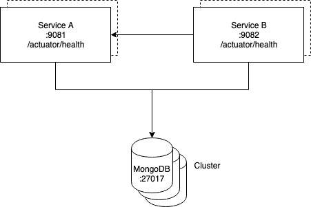

# Exercice 4 - (Advanced) Mongodb cluster 

Actuellement chaque microservice est déployé avec sa propre instance de `mongodb`. 
Ces `mongodb` tournent en mono-instance ce qui n'est évidemment pas adapté dans un environnement de production.     
De la même manière, il n'est pas opportun que chaque microservice dispose de son propre cluster.

Le but de cet exercice sera donc d'installer un unique cluster partagé entre les différents microservices.
Nous commencerons par installer un cluster `mongodb` via son propre chart personnalisé puis nous ferons pointer les
microservice A et B sur le cluster fraîchement déployé.

Notez que, au sein du cluster, il sera très important d'isoler les bases de dédiées à chacun des microservices.   

## 1. Clusteur mongodb

### Instructions

* Créer le nouveau chart `xke-helm-mongodb`
* Supprimer les templates
* Paramétrer le `values.yaml` pour passer le mongodb en mode cluster 

Solution

File `xke-helm-mongodb/values.yaml`

    ...
    
    replicaSet:
      
    

*Bravo ! Vous êtes arrivés à la fin de hands-on ! Felicitations !!!* 

[< Previous](ex4-template-helpers.md) | [Home](README.md)